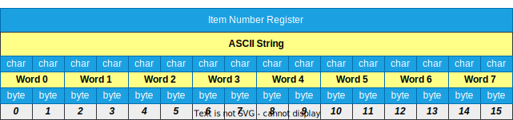
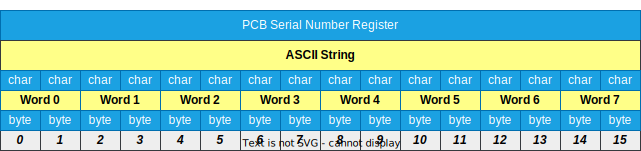

# Modbus Register Description

## Hardware Version Register

The hardware version register is the same for rotor and gateway.

| **Mayor** | **Minor** | **Variant** | **Release** |
| ------ | ------ | ------ | ------ |
|  1 | 2 | 3 |  4 |

==> ***v1.2.3.4***

## Firmware Version Register

The firmware version register is the same for rotor and gateway.

| **Mayor** | **Minor** | **Patch** | **Reserved** |
| ------ | ------ | ------ | ------ |
|  1 | 2 | 3 | 0 |

==> ***v1.2.3***

## Serial Number Register

The serial number register is the same for rotor and gateway.

| **Byte 0** | **Byte 1** | **Byte 2** | **Byte 3** | **Byte 4** | **Byte 5** | **Byte 6** | **Byte 7** | **Byte 8** | **Byte 9** | **Byte 10** | **Byte 11** | **Byte 12** | **Byte 13** | **Byte 14** | **Byte 15** |
| ------ | ------ | ------ | ------ | ------ | ------ | ------ | ------ | ------ | ------ | ------ | ------ | ------ | ------ | ------ | ------ |
|  0x32 | 0x34 | 0x32 | 0x36 | 0x44 | 0x30 | 0x30 | 0x33 | 0x32 | 0x39 | 0x00 | 0x00 | 0x00 | 0x00 | 0x00 | 0x00 |
| 2 | 4 | 2 | 6 | D | 0 | 0 | 3 | 2 | 9 | - | - | - | - | - | - |

==> ***2426D00329______***

## Item Number Register

The itemnumber register is the same for rotor and gateway.

| **Byte 0** | **Byte 1** | **Byte 2** | **Byte 3** | **Byte 4** | **Byte 5** | **Byte 6** | **Byte 7** | **Byte 8** | **Byte 9** | **Byte 10** | **Byte 11** | **Byte 12** | **Byte 13** | **Byte 14** | **Byte 15** |
| ------ | ------ | ------ | ------ | ------ | ------ | ------ | ------ | ------ | ------ | ------ | ------ | ------ | ------ | ------ | ------ |
|  0x38 | 0x33 | 0x30 | 0x36 | 0x35 | 0x35 | 0x33 | 0x00 | 0x00 | 0x00 | 0x00 | 0x00 | 0x00 | 0x00 | 0x00 | 0x00 |
| 8 | 3 | 0 | 6 | 5 | 5 | 3 | - | - | - | - | - | - | - | - | - |

==> ***8306553_________***

## PCB Serial Number Register

| **Byte 0** | **Byte 1** | **Byte 2** | **Byte 3** | **Byte 4** | **Byte 5** | **Byte 6** | **Byte 7** | **Byte 8** | **Byte 9** | **Byte 10** | **Byte 11** | **Byte 12** | **Byte 13** | **Byte 14** | **Byte 15** |
| ------ | ------ | ------ | ------ | ------ | ------ | ------ | ------ | ------ | ------ | ------ | ------ | ------ | ------ | ------ | ------ |
|  0x35 | 0x30 | 0x32 | 0x30 | 0x30 | 0x33 | 0x37 | 0x31 | 0x35 | 0x37 | 0x30 | 0x30 | 0x30 | 0x38 | 0x36 | 0x38 |
| 5 | 0 | 2 | 0 | 0 | 3 | 7 | 1 | 5 | 7 | 0 | 0 | 0 | 8 | 6 | 8 |

==> ***5020037157000868***

## Gateway specific registers

### Gateway Pairing Command

This is a FC01/FC05 read/write single coil command.

The gateway pairing command will start a new pairing request, regardless of the actual pairing state.  Once pairing has started, it cannot be stopped until either a rotor is found, and paired, or the pairing timed out (after about 60 seconds).

You can read back the actual pairing state to check if pairing is still active or not.

| Name | Datatype | Description | Read | Write |
| - | - | - | - | - |
| Pairing | uint16 | Start pairing | 0 / 1 | 0xFF00 = On |

### Gateway Restart Command

This is a FC01/FC05 read/write single coil command.

This command will restart the gateway immediately.

| Name | Datatype | Description | Read | Write |
| - | - | - | - | - |
| Restart | uint16 | Restart gateway | always 0 | 0xFF00 = Restart |

### Gateway Run Mode Command

This is a FC01/FC05 read/write single coil command.

This command will switch the run mode on or off. You can read back the actual run mode value to check if it is active or not.

| Name | Datatype | Description | Read | Write |
| - | - | - | - | - |
| Run Mode | uint16 | Switch run mode on or off | 0 = Off   1 = On | 0 = Off   0xFF00 = On |

### Gateway Analog Range Register

| Name | Datatype | Description | Possible values |
| - | - | - | - |
| Analog Range | uint8 | Get or set the gateway analog output range | 0 = 0-10V   1 = 0-20mA |

## Rotor specific registers

### Rotor Tara Command

This is a FC01/FC05 read/write single coil command.

This command will enable or disable the rotor tara funktion. If you enable tara the actual torque value will be used as new zero value.

Please note:

- This command is only available if rotor is ***not*** in `run mode`
- ***This is a temporary functionality. A rotor restart will reset this value***

| Name | Datatype | Description | Read | Write |
| - | - | - | - | - |
| Tara | uint16 | Switch tara on or off | 0 = Off   1 = On | 0 = Off   0xFF00 = On |

### Rotor Restart Command

This is a FC01/FC05 read/write single coil command.

This command will restart the rotor immediately.

Please note:

- This command is only available if rotor is ***not*** in `run mode`

| Name | Datatype | Description | Read | Write |
| - | - | - | - | - |
| Restart | uint16 | Restart rotor | always 0 | 0xFF00 = Restart |

### Rotor Reset Min/Max Command

This is a FC01/FC05 read/write single coil command.

This command will reset the minimum and maximum peak torque values on the rotor. The peak torque values are the *unfiltered* torque values of the rotor. Reset this value if you want to check for torque peaks in a specific situation. Please refer to [Rotor Process Data Register](#rotor-process-data-register) `MinHold` and `MaxHold` values for details.

Please note:

- This command is only available if rotor is ***not*** in `run mode`
- ***This is a temporary functionality. A rotor restart will reset this value***

| Name | Datatype | Description | Read | Write |
| - | - | - | - | - |
| Reset Min/Max | uint16 | Reset minimum and maximum peak torque values | always 0 | 0xFF00 = Reset |

### Rotor Package Header Register

| Name | Datatype | Description | Possible values |
| - | - | - | - |
| ID | uint8 | Packet identification code | always 0x22 |
| Channel | uint8 | Actual channel or, if channel has to change, the next channel | 0 - 37 |
| Process State | uint8 | Contains the actual state of the rotor |   0 = Not initialized   1 = Active   2 = Connected   3 = Run mode   4 = Update |
| Payload Length | uint8 | The number of bytes in the [Payload Array](#rotor-payload-array-register).  This can vary depending on the filter setting in the rotor  | 30, 50 or 100 |
| Package Number | uint16 | Packet counter that increments with every new packet | 0 - 65535 |
| Transmit Datarate | uint16 | The actual rotor transmit rate in ***milliseconds*** | 50 - 1000 in 50 ms steps |
| Average Samplerate | uint16 | The averaged sample rate between two values in ***microseconds*** This can vary depending on the filter setting in the rotor | ~350, ~700 |
| Timestamp | uint64 | Unix timestamp in ***microseconds*** if gateway time has been set,   otherwise this value starts at 0 | 0 - uint64 max |

### Rotor Process Data Register

| Name | Datatype | Description | Possible values |
| - | - | - | - |
| Torque | int16 | Raw torque value in digits This value must be [converted](../ValueConversion/README.md#torque-value-conversion) to Nm | -30000 - +30000 |
| Speed | int16 | Actual rotor speed in ***rpm*** | -32768 - +32767 |
| Temp | int16 | Actual rotor temperature This value must be [converted](../ValueConversion/README.md#temperature-value-conversion) to ***°C*** | -400 - +850 |
| InVoltage | uint16 | Actual input voltage of the rotor  This value must be [converted](../ValueConversion/README.md#input-voltage-value-conversion) to ***volt*** | 0 - ~43000 |
| MinHold | int16 | Raw minimum holding torque value in digits  (negative peak torque value) This value must be [converted](../ValueConversion/README.md#torque-value-conversion) to Nm | -30000 - 0 |
| MaxHold | int16 | Raw maximum holding torque value in digits  (positive peak torque value) This value must be [converted](../ValueConversion/README.md#torque-value-conversion) to Nm | 0 - +30000 |
| X | int16 | Not implemented | - |
| Y | int16 | Not implemented | - |
| Z | int16 | Not implemented | - |

### Rotor Payload Array Register

The payload array contains the raw torque data values in digits of one packet.  The number of ***bytes*** available in this array is transmitted in the packet [header](#rotor-package-header-register) `Payload Length` field.  Divide this value by 2 to get the number of ***words*** respectively.

`Please note that the payload array data is only available in run mode.`

To convert the digits to Nm please check out [this](../ValueConversion/README.md#torque-value-conversion) conversion document.

### Rotor Filter Selection Register

| Name | Datatype | Description | Possible values |
| - | - | - | - |
| Filter selection | uint8 | Get or set the rotor torque filter | 0 = 1Hz   1 = 10Hz   2 = 100Hz   3 = 200Hz   4 = 500Hz   5 = 1kHz |

### Rotor Transmit Rate Register

| Name | Datatype | Description | Possible values |
| - | - | - | - |
| Transmit Rate | uint8 | Get or set the rotor transmit rate in ***milliseconds***   This value ***must*** be a multiple of 50 | 50 - 1000 |
