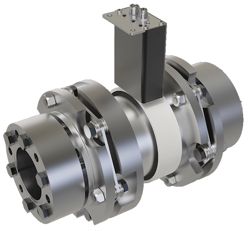

# ROBA®-drive-checker communication examples

## Table of contents

1. [Introduction](#introduction)
1. [Password generation](#password-generation)
1. [Change log](#change-log)

## Introduction

This is the documentation for the ROBA-drive-checker Gateway communication protocols via the ethernet interface. So far, we support the following protocols.

- [Modbus TCP](Modbus/README.md)
- [REST-API](REST-API/README.md)
- [WebSocket](WebSocket/README.md)

Each of these protocols has its own directory structure next to this document and every directory has its own README.md for further details.

## Password generation

To be able to use all functionalities of the ROBA-drive-checker REST-API requests, two different passwords are needed, depending on the service level.

### Description

The system `default` password implementation for the 2 different service levels is defined as follows:

- We use the device serial number with 10 characters as the base for the password to have a variation for each delivered device.

  `YearYearWeekWeek(country code D/P etc.) and the device number 00000-99999 (e.g. 2419D01234)`
- We add `fill values` (characters) at different positions in a `custom order array` and change the positions and the number of fill values for each service level to make it less predictable
- We change the order of the characters from the serial number for each service level

### Custom order array

The custom order array is an int8_t array (but can be any signed data type) to store indices.

```c
int8_t order[] = { -1, -1, 0, 1, 2, 3, 4, 5, 6, 7, 8, 9, -1 }
```

- -1 defines a position where a `fill value` should be added
- 0 - 9 are the indices of a character from the original serial number

### Fill values

Fill values are added to the password at the positions where -1 is set in the custom order array.

- These fill values must be of type `char` (or byte in other languages).
- The number of fill values `must` be equal to the number of -1 values in the custom order

```cpp
char fillValues[] = { 'k', 'x', '!' };
```

## Actual implementation in drive-checker

### Customer password

order = { -1, -1, 0, 1, 2, 3, 4, 5, 6, 7, 8, 9, -1 }

fillValues = { 'k', 'x', '!' }

Serial = `2419D00008`

| -1 | -1 | 0 | 1 | 2 | 3 | 4 | 5 | 6 | 7 | 8 | 9 | -1 |
| -  | -  | - | - | - | - | - | - | - | - | - | - | -  |
| k  | x  |   |   |   |   |   |   |   |   |   |   | !  |
|    |    | 2 | 4 | 1 | 9 | D | 0 | 0 | 0 | 0 | 8 |    |

The password is:

```text
kx2419D00008!
```

### Service password

order = { -1, -1, 5, 6, 7, 8, 9, -1, 4, 0, 1, 2, 3, -1 }

fillValues = { 'H', 'c', '!', 'T' }

Serial = `2419D00108`

| -1 | -1 | 5 | 6 | 7 | 8 | 9 | -1 | 4 | 0 | 1 | 2 | 3 | -1 |
| -  | -  | - | - | - | - | - | -  | - | - | - | - | - | -  |
| H  | c  |   |   |   |   |   | !  |   |   |   |   |   | T  |
|    |    | 0 | 0 | 1 | 0 | 8 |    | D | 2 | 4 | 1 | 9 |    |

The password is:

```text
Hc00108!D2419T
```

### C/C++ Code

```c
/*!
 * @brief This function creates a password from serialNumber, fillValues and order and stores it in destination.
 * 
 * @param destination The destination array where the password shall be stored.
 * @param serialNumber The serial number which shall be used to generate the password
 * @param fillValues The fill values which should be set in place instead of the -1 values in the order array
 * @param fillValueLength The number of bytes of the fillValues array
 * @param order The array where the password generation order is stored
 * @param orderLength The number of bytes of the order array
 */
void CreatePassword(char* destination, const char* serialNumber, const char* fillValues, int fillValueLength, const int8_t* order, int orderLength)
{
    int fillIndex = 0;
    size_t serialNumberLength = strlen(serialNumber);
    char *destPtr = destination;

    for (int i = 0; i < orderLength; i++)
    {
        // -1 tells us we must use the actual fill value from the array
        if (order[i] == -1)
            *destPtr++ = fillValues[fillIndex++];
        else
        {
            if (order[i] < serialNumberLength)
                // use the value from the serial number at position order[i] (0-9)
                *destPtr++ = serialNumber[order[i]];
            else
                // if serial number is too short, we fill with '0' character
                // this prevents us from having an invalid password or a password that can't be entered
                // because who knows what's written at this memory position?
                *destPtr++ = '0';
        }
    }
    *destPtr = 0; // terminate string

    if (fillIndex != fillValueLength)
        Log.error("SecuritySettings", "Please check value order. FillIndex %i does not match length of %i", fillIndex, fillValueLength);
}
```

Usage:

```cpp
// define the customer parameters
static const int8_t customerOrder[] = { -1, -1, 0, 1, 2, 3, 4, 5, 6, 7, 8, 9, -1 };
static const char customerFillValues[] = { 'k', 'x', '!' };

// define the service parameters
static const int8_t serviceOrder[] = { -1, -1, 5, 6, 7, 8, 9, -1, 4, 0, 1, 2, 3, -1};
static const char serviceFillValues[] = { 'H', 'c', '!', 'T' };
```

```c
// Generate customer password
CreatePassword(customerPassword, getSerialNumber(), customerFillValues, sizeof(customerFillValues), customerOrder, sizeof(customerOrder));

// Generate service password
CreatePassword(servicePassword, getSerialNumber(), serviceFillValues, sizeof(serviceFillValues), serviceOrder, sizeof(serviceOrder));
```

## Change log

v1.0.0 First release
