# ROBA®-drive-checker Bruno REST-API documentation

## Table of contents

1. [Introduction](#introduction)
1. [Open a collection in Bruno](#open-a-collection-in-bruno)
1. [Selecting an environment](#selecting-an-environment)
1. [Configure and environment](#configure-an-environment)
1. [Check the `Docs` tab](#check-the-docs-tab)
1. [Test the drive-checker connection](#test-the-drive-checker-connection)
1. [Send a PUT request without body](#send-a-put-request-without-body)
1. [Send a PUT request with JSON body](#send-a-put-request-with-json-body)

## Introduction

Bruno is an opensource API client for exploring and testing APIs. It is a community driven project which is completely free, even for commercial use (at least at the time of writing this document)

Bruno can be downloaded here [https://www.usebruno.com/](https://www.usebruno.com/)

We have created a collection of requests for you in the Bruno application to ensure you a quick start.

Please follow these steps on the website to get started with the Bruno app. Once you have finished the installation, follow the instructions below to load and use the collection of requests.

## Open a collection in Bruno

Use one of the two buttons as shown in the image below to open an existing collection.

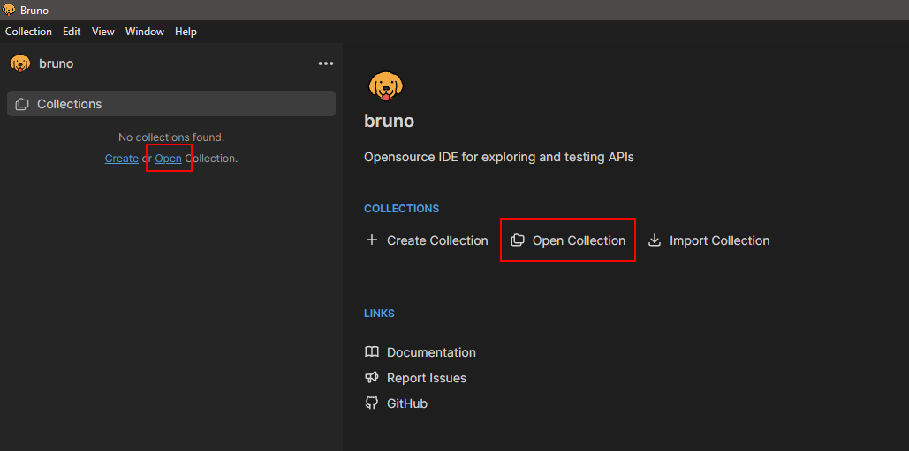

Navigate to the directory where the collection is stored. This should be usually `rdc-communication-examples/REST-API/Bruno/ROBA drive-checker Gateway` and click on `Select Folder`.

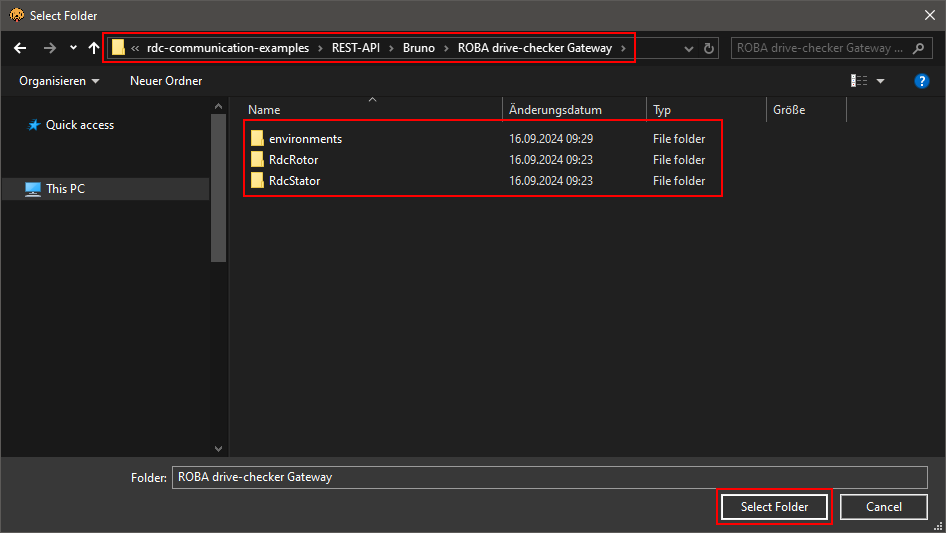

Once the collection has been opened you should see the collection in the Bruno collection view

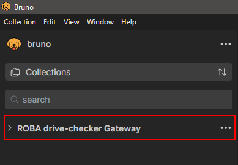

Expand the collection by clicking on `>`. The collection has been divided into two groups. The `RdcRotor` and the `RdcStator` groups. Each group provides a bunch of requests for the specific group. `RdcRotor` provides requests for the `rotor` or `sleeve` and `RdcStator` provides requests for the gateway itself.

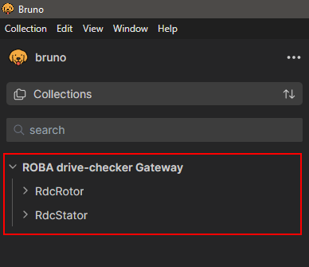

Expand each group by clicking on `>`.

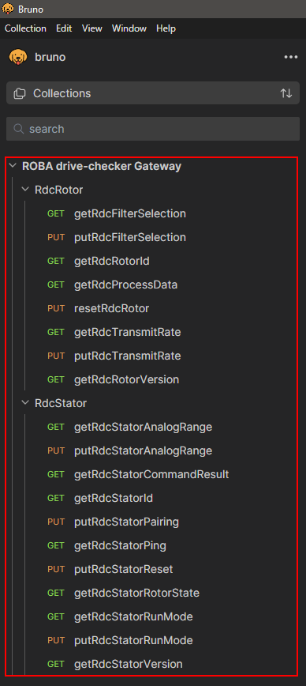

## Selecting an environment

To be able to send requests to the gateway an environment must be selected. If you click on the `getRdcRotorFilterSelection` request you will see that `{{baseUrl}}` of the `GET` request is highlighted in red. This means that the variable `baseUrl` is not found.

If you have a closer look at the top right of the app you will see the environment selection drop-down which shows us `No Environment` is selected.

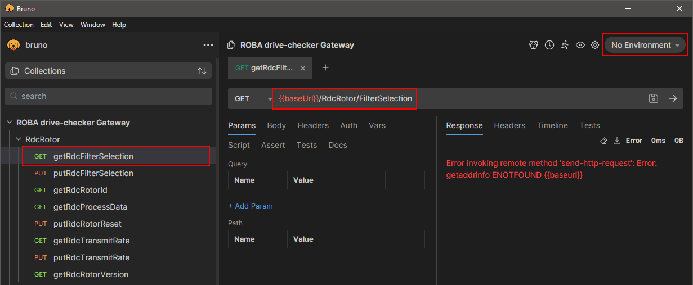

We have prepared two basic environments for you to start with.

- `rdc-customer` for `Customer` user access
- `rdc-service` for `Service` user access

Click on the drop-down menu and select the `rdc-customer` environment.

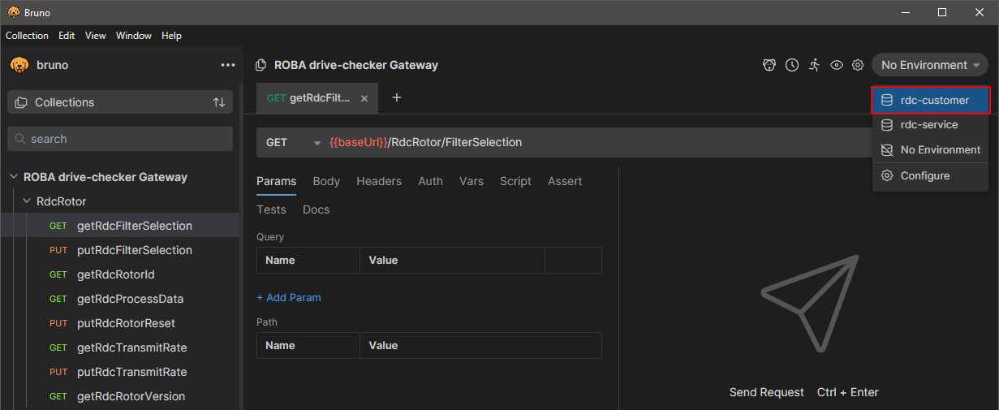

Once the environment is selected and configured, the `baseUrl` variable should turn green.

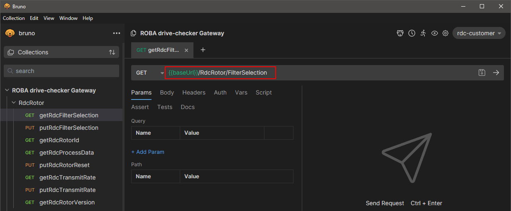

## Configure an environment

 After selecting the environment click on the environment drop-down again and select `Configure` to change environment variables as required for your network.

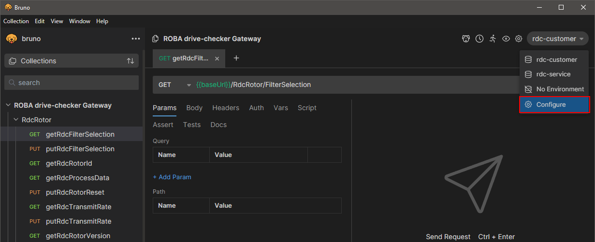

`baseUrl` is the IP Address or hostname of the ROBA drive-checker

`username` is the user you want to use for your requests.

There are two different users (service level) available, `Customer` and `Service`. By default, the `Customer` user is selected, to prevent unauthorized access to protected `Service` features.

TODO the following information is wrong!!!
 If you need access to `Service` features, please contact our customer support to request the `Service` password.

`password` is the password for the current user/service level. The password for the `Customer` user is always `kx`(device serial number)`!` as shown in the image below.

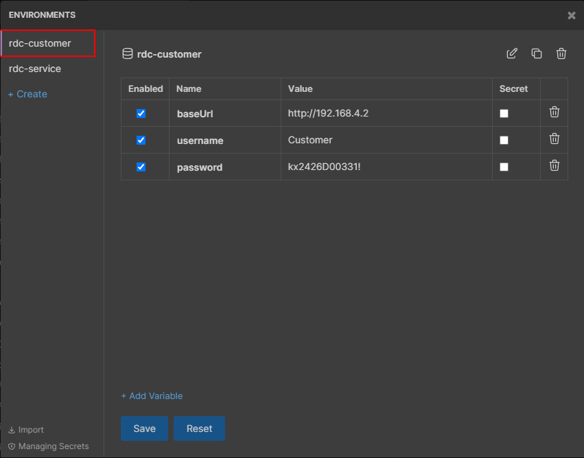

After the `rdc-customer` environment is set up, you must update the `rdc-service` environment as well.

## Check the `Docs` tab

Every request has a `Docs` tab in it where we have a quick documentation for each request.

The documentation is divided into the following sections.

- A short description of the request
- The required user/service for the request.
- A description of the JSON values for the request
- What values you have to expect with a `GET` request or what kind of values you have to send with a `PUT` request
- An example of the JSON `Body` for `PUT` requests
- Possible `Response` status codes and JSON response values

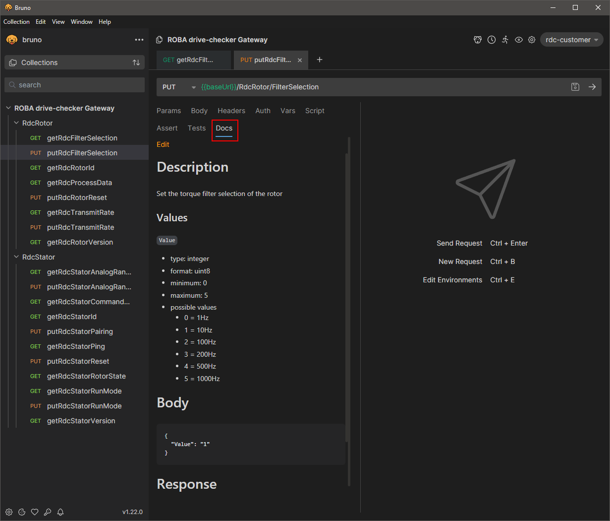

## Test the drive-checker connection

Now we are ready to test the connection to the ROBA drive-checker. Please connect your PC to the same network as the ROBA drive-checker Gateway before proceeding.

We highly recommend starting with `GET` requests to the gateway to get a feeling for how things work if you have never worked with REST-API commands.

Select the `getRdcStatorAnalogRange` request from the `RdcStator` group on the left side and click the `Send` button (the little right arrow) next to the `Save` button on the right as shown in the image below.

If everything works as expected, you should see the `Response` from the gateway with a http status code `200 OK` as shown below.

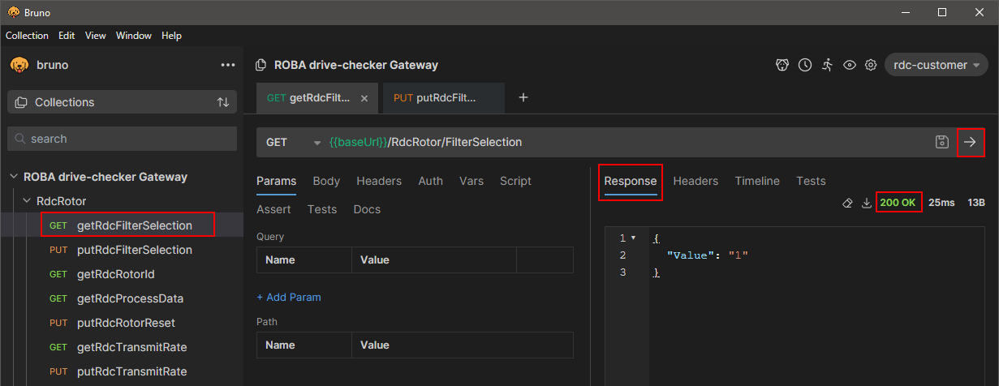

## Send a PUT request without body

Some of the `PUT` requests do not require a JSON body and can be sent without it. For example, the `putRdcStatorReset` request is one of these commands.

Select the `putRdcStatorReset` request from the `RdcStator` group on the left side and click the `Send` button next to the `Save` button on the right as shown in the image below.

If the request has been sent successfully, the response status code should be `202 Accepted`. This request will restart the gateway immediately.

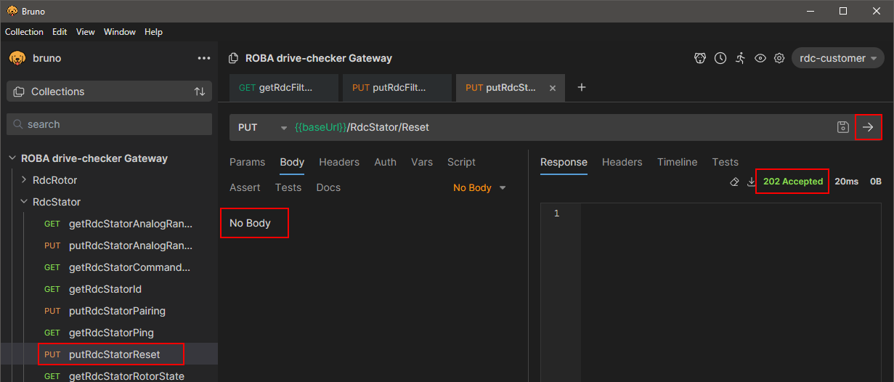

## Send a PUT request with JSON body

> ATTENTION!
>
> This request will change the analog output configuration. Before proceeding, please make sure that the analog output is neither connected nor shortened.

> NOTE!
>
> This request requires the user/service level `Service`, otherwise you will receive the status code `401 Unauthorized`

Click on the `Environment` drop-down menu and select the `rdc-service` environment.

Sending a `PUT` request is mostly like sending a `GET` request to the drive checker. The only difference is that some of the requests need an additional JSON `Body` for the request. We already have prepared the JSON `Body` object so you only need to change the value(s) for the request.

Please check out the `Docs` tab of the request for possible values for each request.

Select the `putRdcStatorAnalogRange` request from the `RdcStator` group on the left side and click on the `Body` tab as shown in the image below.

In case of the analog output range, you only have the following two options

- 0 = 0-10V
- 1 = 0-20mA

By default, the output range is set to `0` (0-10V output), change the value in the `Body` tab to `1` to choose the 0-20mA range like so.

```json
{
  "Value": 1
}
```

If you only want to test the request, you can also leave the value at `0` and send the request directly. This will not change the analog output range, but you can see if the request is working or not.

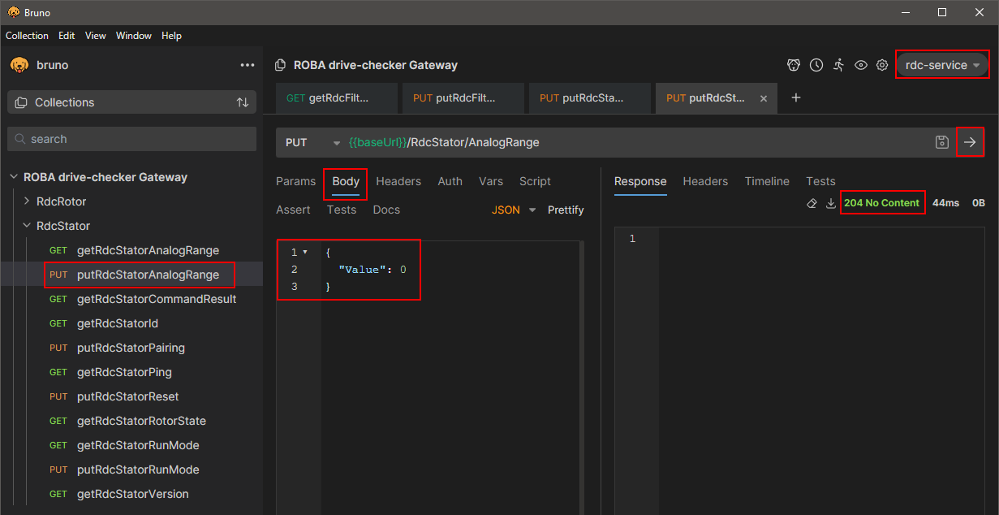

[Back to REST-API overview](../README.md)
