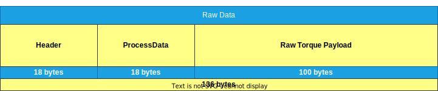

# ROBA®-drive-checker WebSocket documentation

## Table of contents

1. [Introduction](#introduction)
1. [Default configuration](#default-configuration)
1. [Message logger](#message-logger)
1. [Data logger](#data-logger)
1. [Raw data logger](#raw-data-logger)
1. [Exampels](#examples)

## Introduction

The ROBA®-drive-checker has a WebSocket-Server which is enabled by default. We use WebSockets over REST-API or Modbus TCP for data transfer because it reduces network traffic and it is fast and reliable.

So far we have only insecure WebSockets `ws://` implemented. Therefore the secure `wss://` connections are not supported.

For a detailed desccription of the WebSocket API please refer to the [Mozilla mdn web documentation](https://developer.mozilla.org/en-US/docs/Web/API/WebSockets_API).

## Default configuration

The connection can be established via the URI `ws://hostname:81/` plus the logger type (see below). The default port is `81` and cannot be changed.

The maximum number of clients/substribers per WebSocket address is limited to 2.

## WebSocket Loggers

There are three different WebSocket loggers available.

### Message logger

`ws://hostname:81/MessageLogger`

Socket data type: `binary`

The MessageLogger can be used to receive status and debug information from the drive-checker Gateway.

This data includes information about the system state, warnings and errors. If the drive-checker is not in run mode we also print out the actual rotor values like raw torque, rotor voltage, rpm and the actual transmit channel of the radio module.

The rotor values depend on the actual rotor transmit rate, which is 500 milliseconds by default. If you want to change the transmit rate via WebSockets, please check out [Setting the rotor transmit rate](#setting-the-rotor-transmit-rate) below.

Every message contains a unix time stamp, a log level, the message source and the message itself like in the example below.

```bash
1729662144168000 [INF] [RDCRotor] 0 Digits; 28.84V; 0 rpm; 52.67 ms; ch 3; buffLen 1
1729662144607000 [INF] [RDCRotor] 0 Digits; 28.84V; 0 rpm; 53.02 ms; ch 3; buffLen 1
1729662145046000 [INF] [RDCRotor] Run mode change requested
1729662145485000 [INF] [RDCRotor] Setting run mode to 1
1729662145924000 [INF] [RDCRotor] State changed successful to 3
1729662146363000 [INF] [BoardSettings] Saving...
```

### Data logger

`ws://hostname:81/DataLogger`

Socket data type: `binary`

The DataLogger is only active if run mode is enabled. The DataLogger only sends the actual rotor values without any of the information of the MessageLogger. Therefore this data can be saved directly into a csv file and can be imported into Excel or other data viewer applications.

Like the MessageLogger, the DataLogger depends on the actual rotor transmit rate. Therefore you are able to reduce the amount of data depending on your needs. If you want to change the transmit rate via WebSockets, please check out [Setting the rotor transmit rate](#setting-the-rotor-transmit-rate) below.

A typical DataLogger output looks like this.

```bash
1729662144168000;-12;-0.08;33.4;0;125;8.81;354
1729662144607000;-5;-0.03;33.4;0;125;8.77;354
1729662145046000;-4;-0.03;33.4;0;125;8.69;354
1729662145485000;-7;-0.04;33.4;0;125;8.74;354
1729662145924000;-13;-0.08;33.4;0;125;8.49;354
1729662146363000;-10;-0.06;33.4;0;124;8.37;354
1729662146802000;-8;-0.05;33.4;0;123;8.92;354
```

Where:

| 1 | 2 | 3 | 4 | 5 | 6 | 7 | 8 |
| - | - | - | - | - | - | - | - |
| 1729662144168000 | -12 | -0.08 | 33.4 | 0 | 125 | 8.81 | 354 |
| Timestamp | Torque | Torque | Temperature | Revolutions | Packet buffer size | Cycle time | Average sample rate |
| unix time | digits | Nm | °C | rpm | - | ms | us |

### Raw data logger

`ws://hostname:81/RawDataLogger`

Socket data type: `binary`

The RawDataLogger is only active if run mode is enabled. The RawDataLogger sends only unprocessed raw data to the connected WebSocket client, as soon as a new packet has been received from the rotor. Therefore this logger will send a new message about every 8.5 milliseconds as a live stream.

The packet is a 136 byte array which consists of a [packet header](../Modbus/ModbusDataStructure.md#rotor-package-header-register), a [process data field](../Modbus/ModbusDataStructure.md#rotor-process-data-register) and a [payload array](../Modbus/ModbusDataStructure.md#rotor-payload-array-register).

The number of values in the payload array is depending on the selected torque filter. Please use the `PayloadLen` value of the [header](../Modbus/ModbusDataStructure.md#rotor-package-header-register) to get the number of bytes that is stored in the payload array.



## Configuration options

### Setting the gateway unix timestamp

Socket data type: `text`

You can set the gateways unix timestamp by sending a json formatted string through the web socket. The unix timestamp must be in milliseconds as shown in the example below.

Please note that you can only set the timestamp once to the gateway! Setting the timestamp a second time will be ignored by the gateway. If you want to change the timestamp you have to restart the gateway first, and then set the timestamp again.

```json
{
    "TimeUTC": "1729838267519"
}
```

Please check out the `_onOpen` funtion in the [HTML Javascript example](Examples/HTML/index.html) for more information about the implementation.

### Setting the rotor transmit rate

Socket data type: `text`

The rotor transmit rate only affects the data rate for the `MessageLogger` and the `DataLogger`. The rate of the `RawDataLogger` is always fixed.

```json
{
    "TransmitRate": "50"
}
```

Please check out the `_onOpen` funtion in the [HTML Javascript example](Examples/HTML/index.html) for more information about the implementation.

## Examples

- [HTML Javascript example](Examples/HTML/index.html)
- [VS Code C# example](Examples/VsCode_CSharp/Program.cs)
